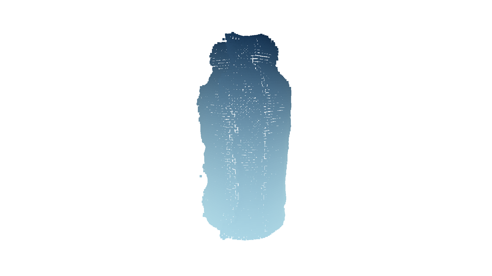
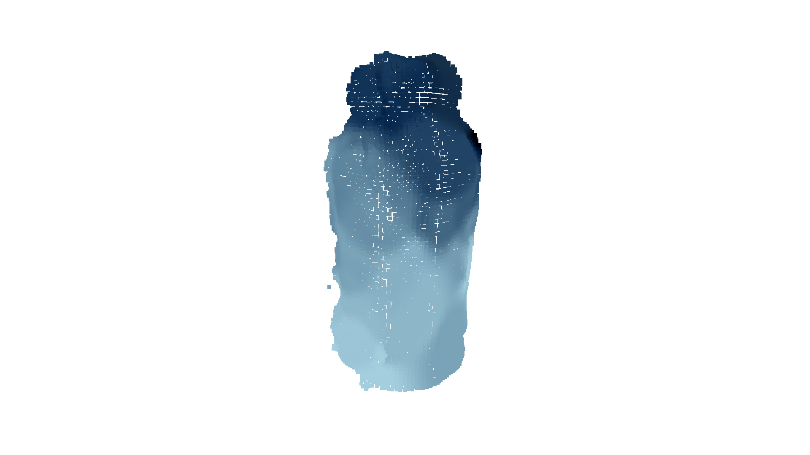

# A Cross-Task Visuo-Tactile Representation Using Point Clouds
### *by Giammarco Caroleo1, Alessandro Albini, and Perla Maiolino*

This page is currently including the abstract of the paper (under review), the outline of the project, and supplementary analyses.

<small>1: Corresponding author email: giammarco@robots.ox.ac.uk</small>
## Table of Contents

1. [Abstract](#abstract)
2. [Outline](#outline)
3. [Supplementary Material](#supplementary)
4. [References](#references)

---

# Abstract

The combination of visual and tactile cues has proved to be effective for object recognition as well as grasping and manipulation tasks. Nevertheless, the two modalities are not trivial to combine since tactile and visual data carry distinct information and may be structurally different. Researchers have addressed this problem by proposing approaches that either do not consider mechanical properties conveyed by tactile sensors or cannot be deployed directly for diverse tasks. In this paper, we propose a cross-task visuo-tactile representation that encodes both the geometrical and mechanical properties of objects in a point cloud data structure. By physically exploring different areas of a given item, we collect tactile information to estimate the local compliance of the surface, encoding it as the color information of the point cloud in the probed areas. Then, this color information is extended to the entire object assuming that neighboring points share the same mechanical properties. We apply the proposed point cloud to a set of 6 real-world objects showing that it  can be effectively used to encode the shape of the objects along with their information on the local compliance. Further, we show that the augmented point cloud can be used for different tasks by exploiting this in three robotic tasks - a visuo-tactile object classification problem, a path following and a reaching in clutter tasks.

---

# Outline

In the manuscript, we present a cross-task representation that leverages the point cloud (PC) data structure to encode visuo-tactile cues. In particular, a PC acquired with RGB-D cameras is used to represent the geometry of the objects, while tactile sensing ([Cyskin](https://www.cyskin.com/) [[1](#1)]) is used to augment it  with physical information embedded in the color assigned to the cloud. Specifically, we use this representation to encode the compliance distribution across the whole object’s surface. We showed how the proposed representation can be used to enhance robot abilities across different tasks, such as object classification, by using directly a state-of-the-art classifier like [PointNet](https://github.com/charlesq34/pointnet) [[2](#2)], and control tasks including path following, and reaching in clutter.

This work was supported by the [SESTOSENSO](http://sestosenso.eu/) project (HORIZON EUROPE Research and Innovation Actions under GA number 101070310).

---

# Supplementary Material
## Gaussian Process based representation 

In this section, we will discuss the Gaussian Process (GP) based representation of the data. 
As a matter of fact, GP-based representation are widely used and could serve as a way of combining mechanical and visual properties. For a formal introduction to GP, we refer the reader to [[3](#3)]. Here, we will discuss how the GP-based representation can be used to encode the local compliance of the object's surface. The analysis that follows assumes that the reader is familiar with the concept of GP, the point cloud (PC) data structure, and has read the main manuscript.

Having a tactile PC, we train a GP to learn a mapping between the geometric feature and the tactile colour. Having this model, we predict the tactile colour for the points belonging to the visual PC. Given the limited amount of tactile points, the resulting augmented representation fails to extend the tactile colour. As a matter of fact, the resulting PC has a tactile colour that smoothly varies from the plastic cap to the bottom in a linear fashion as if the model overfits the geometrical feature rather than fitting the tactile properties. In [Figure 1](#Figure1) it can be seen that the tactile colour is spread such that points on the top are darker and points on the bottom have a lighter colour associated with them. As expressed in the letter, since a holder is used to keep the object in place, the bottle is expected to be less compliant also at the bottom. This entails that the trained GP model disregards the tactile readings.  

<!-- 
 -->
 
*Fig. 1: GP-based representation of the empty bottle.*
<!-- 
 -->

This issue is likely related to the limited amount of data the model is trained on. Indeed, to further prove this, we artificially increased the tactile PC and re-trained the model. To this end, we searched for the points in the visual PC belonging to a 3 cm neighbourhood of each point of the tactile PC. This way we increase the number of points of the tactile PC and obtain a bigger number of training samples. We chose this size for the radius as it is approximately the size of the tactile sensor and, for this analysis, we assumed that all the points touched by the sensor have the same physical properties. Then, we generated the GP-based augmented representation and got a result that is very similar to the smooth representation as can be seen in [Figure 2](#Figure2). 

<!-- 
 -->

*Fig. 2: GP-based representation of the empty bottle using an artificially increased tactile PC.*
<!-- 
 -->

The generation of the augmented representation in this case is highly computationally intensive and heavily depends on the number of points of the tactile PC. In this case, once the neighbouring points were found, the artificially increased PC was downsampled otherwise the training of the GP model would have been unfeasible (given the capabilities of the laptop used for this work, i.e. Intel Core i7-12700H CPU). The voxel size was varied and the best representation ([Figure 2](#Figure2)) was obtained with a voxel size of 0.004 m. This way the computation takes ~132 seconds and yields a result that is comparable to the smooth representation which conversely takes ~6.5 seconds and is way less memory-intensive. 
The computation efficiency could certainly be improved if a smaller radius is used for the neighbour search; however, it is evident that this approach requires further analyses since more hyperparameters are involved and is not justified from a computational point of view even considering that the results are similar to the ones obtained with the other more efficient representations. 

In conclusion, even though the GP-based representation may also serve as a tool to encode the local compliance of the object's surface, we found out that for our application it is not suitable because of its greater computational cost, more intensive engineering burden and results not significantly better than the ones obtained with the smooth representation.

---

## References

1. [https://www.cyskin.com/](https://www.cyskin.com/)

2. C. R. Qi, H. Su, K. Mo, and L. J. Guibas, “Pointnet: Deep learning on point sets for 3d classification and segmentation,” in Proceedings of the IEEE conference on computer vision and pattern recognition, 2017, pp. 652–660.

3. C. Williams and C. Rasmussen, “Gaussian processes for regression,” Advances in neural information processing systems, vol. 8, 1995.